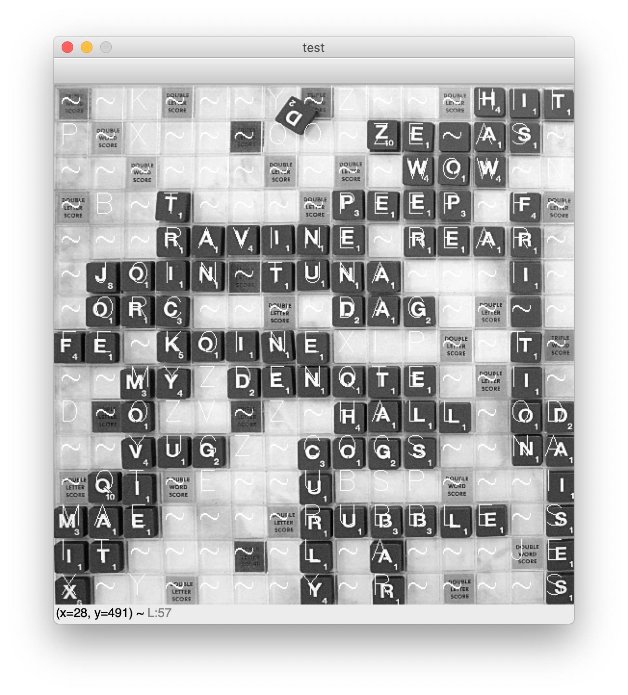

## **Using Keras and Tensorflow to Identify Scrabble Letters**

   **To generate a keras weights file:**
   

    cd CNN/
	python3 letter_detection.py

**To apply the weights file and test CNN accuracy:**

    cd CNN/
    python3 sliding_window.py
    
This should generate a picture of Scrabble board and then a text overlay of predicted letters.

